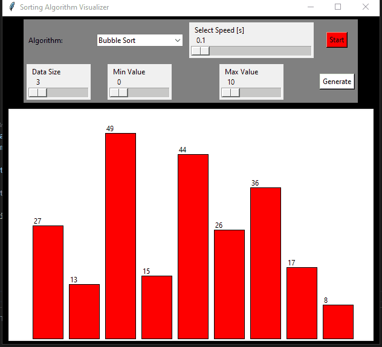
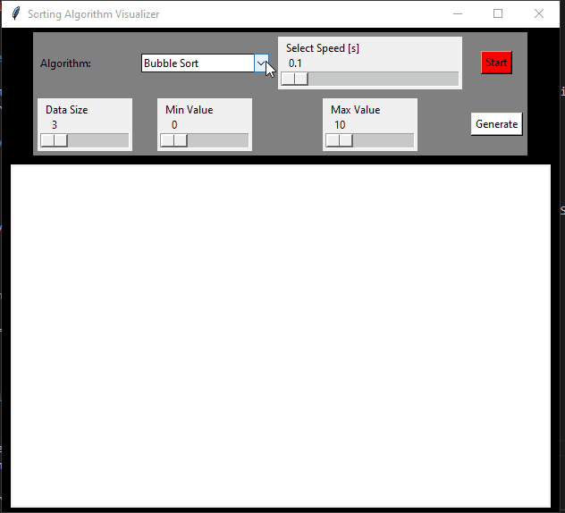

# sorting-algorithm-visualizer
<br />
<p align="center">

<h2 align="center">SORTING ALGORITHM VISUALIZER</h2>

<h3 align="center">
 Tools: Python, Tkinter Module
</h3>
<br />
</p>

## Table of Contents

- [Project Description](#project-description)
- [User story](#user-story)
- [Demo](#demo)
- [Installation](#installation)
- [Contributing](#contributing)


## Project Description

A simple python gui leveraging tkinter modules to implementing and visualize data algorithms like Bubble Sort, Quick Sort and Merge Sort, which is a widely used in sorting and organizing data. 

## User story

```
As a user,
I want to be able to use the sorting visulizer to implement Bubble Sort, Quick Sort and Merge Sort.
So that I have a better understanding of these algorithms an dtheir implementation.
```

## Demo
<p align="center">
Bubble Sort
    
</p>
<br />
<p align="center">
Merge Sort
    
</p>

## Installation

1. clone the repo.
2. cd into repo.
3. run python script.
```
python3 .\sortingAlgs.py
```
4. play around with algorithms and data sizes and let the program run.

## Contributing

Collaboration is welcomed! For pull requests and changes, please open an issue first to discuss what changes you would like to make.
